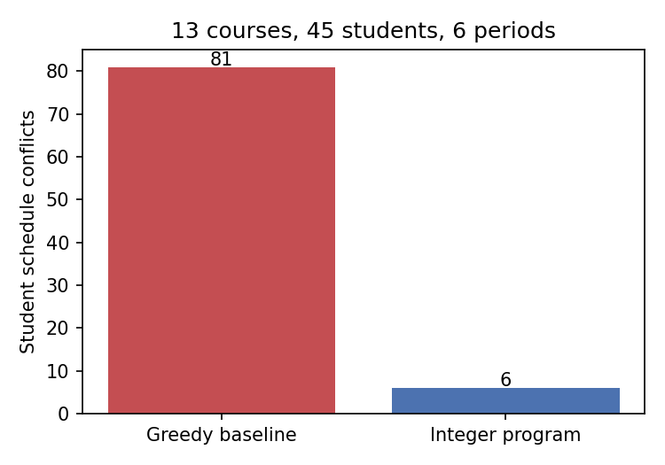
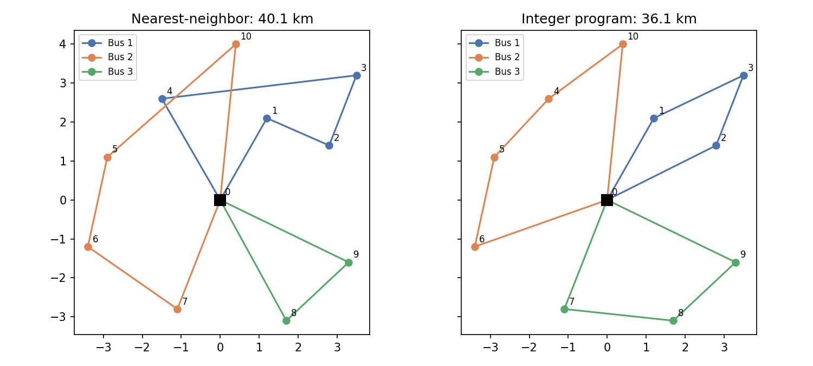

#README.md
The contents of the `README.md` file are reconstructed sequentially from image_2.png, image_3.png, and image.png:
[▶ school-operations](https://hrithikponduru-ops.github.io/school-operations/school-operations-research.html)

```markdown
# Operations Research for a High School

Three optimization problems every school actually has, each modeled as a
linear or integer program, solved with the open-source CBC solver, and
compared against the plan a person would make by hand.

| Stage | Problem | Model type | By hand | Optimized | Solve time |
|---|---|---|---|---|---|
| 1 | Cheapest lunch meeting nutrition targets | Linear program (LP) | $2.45 (hand-built menu) | **$1.14** | < 1 s |
| 2 | Timetable 13 courses so students have no clashes | Integer program (IP) | 81 conflicts | **6 conflicts** (proven optimal) | ~60 s |
| 3 | Route 3 school buses to 10 stops | Capacitated vehicle routing (CVRP) | 40.1 km | **36.1 km** (proven optimal) | ~6 s |




## Why these three

They climb in difficulty and each introduces one new idea:

1. **Stage 1** is a pure LP. Continuous variables, a convex feasible region, and a
   solution the simplex method finds exactly. It introduces *shadow prices*: what
   each constraint costs you at the margin.
2. **Stage 2** needs binary variables (a course is in period 3 or it is not). That
   makes the problem NP-hard in general. It introduces *soft constraints*,
   *domain reduction*, and *symmetry breaking*, and shows the gap between finding
   a good answer and proving nothing better exists.
3. **Stage 3** is the vehicle routing problem. It introduces the *Miller-Tucker-Zemlin*
   formulation, where one clever constraint family enforces bus capacity and
   eliminates disconnected loops at the same time.

Each stage folder has its own README with the full mathematical model, the
constraint-by-constraint mapping to code, results, and a sensitivity discussion.

- [stage1_menu_lp/README.md](stage1_menu_lp/README.md)
- [stage2_timetable_ip/README.md](stage2_timetable_ip/README.md)
- [stage3_bus_routing/README.md](stage3_bus_routing/README.md)

## Run it


```

pip install -r requirements.txt

python -m stage1_menu_lp.run
python -m stage2_timetable_ip.run     # about a minute; proves optimality
python -m stage3_bus_routing.run

python -m pytest tests -v             # 18 tests, ~40 s

```

Figures are written to `figures/`. All data is in each stage's `data/` folder as
plain CSV or JSON so it can be swapped for a real school's data without touching
the model code. Stage 2's student enrollments are generated by
`stage2_timetable_ip/make_data.py` with a fixed seed so results are reproducible.

## Repository layout


```

stage1_menu_lp/       model.py (LP), run.py, data/
stage2_timetable_ip/  model.py (IP), baseline.py (greedy), make_data.py, run.py, data/
stage3_bus_routing/   model.py (CVRP), baseline.py (nearest neighbor), run.py, data/
tests/                one file per stage; each test states which constraint it protects
figures/              generated charts

```

## What the tests check

Tests do not check that the code runs. They check that the *model* means what the
write-up says. For example: the stage 1 objective only counts cost, so a test
verifies every nutrient bound independently. The stage 2 objective is a count the
solver reports, so a test recounts conflicts from the raw assignment and demands
the numbers agree. Every test docstring names the constraint or promise it guards.

## Tools

Python 3.13, [PuLP](https://coin-or.github.io/pulp/) 3.x as the modeling layer,
[CBC](https://github.com/coin-or/Cbc) as the solver (bundled with PuLP), pandas
for data, matplotlib for figures. No commercial solver and no license needed.

## Limitations and next steps

- Distances in stage 3 are straight-line. Real road distances from OpenStreetMap
  would change the routes but not the model.
- Stage 2 schedules one section per course. Real schools have multiple sections,
  which adds a section-assignment variable per student and grows the model fast.
- Stage 1 produces a nutritionally valid but odd menu (three servings of peanut
  butter). The stage 1 README explains why LPs do this and how a variety
  constraint fixes it.
- Stage 2's proof of optimality takes about a minute because the LP relaxation has
  a weak lower bound. Valid inequalities (clique cuts on the student conflict
  graph) would tighten it and are the natural next experiment.

```

---

**requirements.txt**
The contents of the dependencies file are extracted directly from image_4.png:

```text
pulp>=3.0,<4.0
pandas>=2.0
matplotlib>=3.8
pytest>=8.0

```
