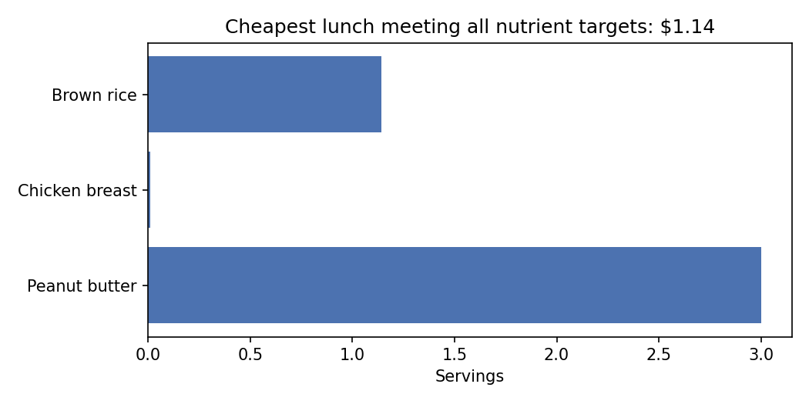

# Stage 1: The Cheapest Nutritious School Lunch (Linear Programming)

**Question.** Given 10 foods with known cost and nutrition, what is the cheapest
lunch that meets calorie, protein, fiber, and sodium targets?

**Answer.** $1.14, versus $2.45 for a sensible hand-built menu. Protein and fiber
are the binding constraints. Raising the protein target by 1 gram would cost
about 3.9 cents.

This is the classic *diet problem*, first posed by George Stigler in 1945 and one
of the first problems ever solved with the simplex method.

## The model

**Index sets**

- $i \in F$: foods (10 of them, in `data/foods.csv`)
- $n \in N$: nutrients with a bound (calories, protein, fiber, sodium, in `data/targets.csv`)

**Data**

- $c_i$: cost per serving of food $i$
- $a_{n,i}$: amount of nutrient $n$ in one serving of food $i$
- $u_i$: most servings of food $i$ a student would realistically eat
- $L_n, U_n$: lower and upper bound on nutrient $n$ (either may be absent)

**Decision variable**

$$x_i \ge 0 \quad \text{servings of food } i \text{ (continuous)}$$

**Objective**

$$\min \sum_{i \in F} c_i x_i$$

**Constraints**

$$L_n \le \sum_{i \in F} a_{n,i} x_i \le U_n \qquad \forall n \in N$$
$$0 \le x_i \le u_i \qquad \forall i \in F$$

## Model to code

| Math | `model.py` |
|---|---|
| $x_i$ with $0 \le x_i \le u_i$ | `pulp.LpVariable(f"x_{i}", lowBound=0, upBound=row.max_servings)` |
| $\min \sum c_i x_i$ | `prob += pulp.lpSum(foods.loc[f, "cost_per_serving"] * x[f] ...)` |
| $\sum a_{n,i} x_i \ge L_n$ | `prob += delivered >= row["min"], f"{nutrient}_min"` |
| $\sum a_{n,i} x_i \le U_n$ | `prob += delivered <= row["max"], f"{nutrient}_max"` |

## Result

```
Minimum cost: $1.14

Menu (servings):
  Peanut butter       3.00
  Chicken breast      0.01
  Brown rice          1.14

Nutrients delivered:      target
  calories     817.2      750 - 850
  protein_g     30.0      >= 30
  fiber_g       10.0      >= 10
  sodium_mg    432.1      <= 1080
```



## Sensitivity analysis: shadow prices

Every constraint in an LP has a *dual value* or *shadow price*: the rate at which
the optimal cost changes if that constraint's bound moves by one unit.

| Constraint | Delivered | Bound | Shadow price | Meaning |
|---|---|---|---|---|
| protein min | 30.0 | 30 | **+$0.0387 / g** | Binding. Each extra gram of required protein costs 3.9 cents. |
| fiber min | 10.0 | 10 | **+$0.0018 / g** | Binding, but cheap. Fiber is nearly free at the margin. |
| calories min | 817.2 | 750 | 0 | Slack by 67 kcal. Loosening it changes nothing. |
| calories max | 817.2 | 850 | 0 | Slack by 33 kcal. |
| sodium max | 432.1 | 1080 | 0 | Slack by a lot. Sodium is not what is driving cost. |

A shadow price of zero on a slack constraint is not a coincidence, it is a theorem
(*complementary slackness*): a constraint that is not tight cannot be what is
holding the objective back. The test file checks this property directly.

## What the odd menu teaches

Three servings of peanut butter is nutritionally valid and no human would serve it.
This is not a bug. LP optima sit at *vertices* of the feasible region, and a vertex
is where the maximum number of constraints are tight, so the solver uses as few
foods as it can get away with. Peanut butter is cheap protein and fiber, so it
saturates its 3-serving limit and the LP fills the remaining protein gap with a
hundredth of a serving of chicken.

Stigler hit exactly this in 1945: his optimal diet was mostly wheat flour,
evaporated milk, cabbage, spinach, and dried navy beans.

**How to fix it (extensions):**

1. **Tighter realism bounds.** Lower `max_servings` for peanut butter to 1 and re-solve.
2. **Variety constraint.** Require at least 4 distinct foods. This needs a binary
   $z_i \in \{0,1\}$ per food with $x_i \le u_i z_i$ and $\sum z_i \ge 4$, turning
   the LP into a small IP, which is exactly the step stage 2 takes.
3. **Diminishing appeal.** Add a per-serving "boredom" penalty that grows with $x_i$.
   Piecewise linear costs keep it an LP.

## Run

```bash
python -m stage1_menu_lp.run
python -m pytest tests/test_stage1_menu.py -v
```